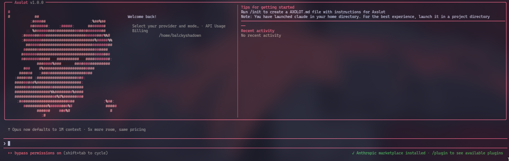

# Axolot

[](https://www.npmjs.com/package/axolot-ai)
[](LICENSE.txt)
[]()
[]()

**Axolot** is a terminal AI coding assistant that runs directly in your terminal — no gateways, no proxies, no external servers. Just you, your terminal, and your choice of AI provider.



## Quick Start

```bash
npm install -g axolot-ai
axolot
```

Then press `/model` to pick your provider and authenticate.

### Other install options

```bash
# Linux/Mac (curl)
curl -fsSL https://raw.githubusercontent.com/JaredBautist/AXOLOT/main/scripts/install.sh | bash
axolot

# GitHub direct
npm install -g github:JaredBautist/AXOLOT
axolot
```

## Features

**Multi-Provider** — Anthropic, OpenAI, Gemini, DeepSeek, and MiniMax. Switch anytime with `/model`.

```bash
axolot use anthropic sonnet
axolot use openai gpt-4o
axolot use gemini gemini-2.5-pro
```

**30+ Built-in Skills** — Invoke with `/<skill-name>`. The model auto-selects them based on your task.

| Category | Skills |
|----------|--------|
| Frontend | `codex-frontend-master`, `frontend-design`, `v0-frontend`, `ui-ux-pro-max` |
| Code Quality | `verify`, `review`, `test`, `refactor`, `simplify`, `self-test` |
| Architecture & Docs | `spec`, `architecture`, `docs`, `commit` |
| Backend & Infra | `api-design`, `database`, `deploy`, `backend-security` |
| Productivity | `debug`, `onboard`, `instructions`, `session`, `batch`, `stuck`, `remember`, `learn`, `token-saver` |
| AI & Providers | `ai-provider`, `skillify`, `keybindings`, `update-config` |

**Spec-Driven Development** — Define requirements, design, and tasks in `.axolot/SPEC.md`. The model reads and updates them as you work.

**Web Search & Fetch** — Built-in web search and URL fetching. The model uses them automatically when it needs current information.

**Session Persistence** — Save and restore session state across terminal sessions with `/session save` and `/session resume`.

**Custom Instructions** — Add project-specific rules in `.axolot/instructions/`. They load every turn automatically.

**Adaptive Learning** — Axolot learns your preferences over time. Use `/learn` to manage memory, skill preferences, and suggestions.

**Token Optimization** — `/token-saver` with 4 modes (`auto`, `eco`, `turbo`, `budget`) to control token consumption. Per-message usage display shows `in:X out:Y` for every response.

## Usage

### CLI Commands

```bash
axolot                    # Open the TUI
axolot chat "prompt"      # One-shot query, no TUI
axolot auth <provider>    # Configure API key
axolot use <provider> <model>  # Switch model
axolot -p openai -m gpt-4o-mini chat "hi"  # Override
```

### Inside the TUI

```text
/model                    # Choose provider & model
/effort normal            # Set response depth

/spec init                # Start project spec
/review                   # Code review
/test                     # Write & run tests
/refactor                 # Safe refactoring
/commit                   # Conventional commit
/self-test                # Run Axolot's own checks
/session save             # Save state
/learn                    # Manage learning & preferences
/token-saver eco          # Optimize token usage
/v0-frontend              # Vercel-v0-style frontend
```

## Requirements

- Node.js 20+
- An API key or OAuth for your chosen provider

## Configuration

Config is stored outside the repo:

```text
~/.config/axolot/direct-providers.json
~/.config/axolot/axolot-runtime/
```

Or use environment variables:

```bash
export ANTHROPIC_API_KEY="sk-..."
export OPENAI_API_KEY="sk-..."
export GEMINI_API_KEY="..."
```

## Provider Support

| Provider | Models | Auth |
|----------|--------|------|
| Anthropic | Sonnet, Opus, Haiku | API key / OAuth |
| OpenAI | GPT-4o, GPT-4o-mini, GPT-5.x | API key / OAuth |
| Google Gemini | Gemini 2.5 Pro, Gemini 2.5 Flash | API key |

## Development

```bash
git clone https://github.com/JaredBautist/AXOLOT.git
cd AXOLOT
npm install
npm start
```

## How It Differs

Axolot is a **direct-provider** TUI. Unlike tools that require a proxy server or gateway:
- Your API calls go directly to the provider — nothing in between
- You own your keys and your data
- No external dependencies beyond Node.js and npm

The skills system is built for Axolot with Spec-Driven Development, session persistence, structured project memory via `.axolot/`, adaptive learning, and per-message token tracking.

## Project Structure

```
.claude/skills/             # Compatible skill format (auto-discovered)
.axolot/                   # Project specs, instructions, session state
  SPEC.md                   #   Requirements, design, tasks
  instructions/             #   Custom project rules
  session.json              #   Current session state
  learning/                 #   Adaptive learning data
    state.json              #     Skill usage, preferences, memories
src/skills/bundled/         # Built-in TypeScript skills (30+)
skillpacks/                 # Curated skill packs
```

## License

MIT

## Acknowledgments

Built on ideas from the open-source AI tooling ecosystem.
